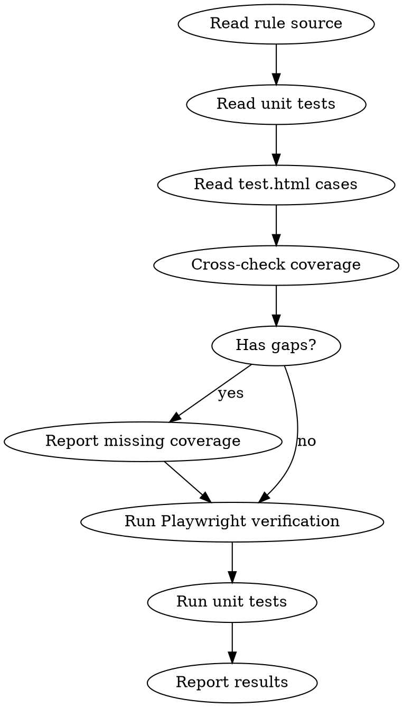

# Verify Rule

Verify a CSS noop rule's correctness and test consistency by cross-checking **rule source**, **unit tests**, **test.html cases**, and **real Chromium computed styles** via Playwright.

## Correctness Standard

This project is **Chromium-behavior-driven**. The ground truth is what `getComputedStyle()` returns in current Chromium, not the CSS spec alone.

- **False positives are worse than false negatives.** If behavior is conditional, context-sensitive, or unclear in Chromium, the rule should stay silent.
- A property that is **partially effective** (e.g. one axis of `place-items` still matters) is NOT a no-op — do not warn.
- If you intentionally keep a known false negative, document the trade-off in the rule comment.

Apply this standard at every judgment point in the workflow below.

## When to Use

- After modifying a rule's logic or default values
- When auditing whether a rule matches real Chromium behavior
- When test.html cases might have false positives/negatives
- Before merging rule changes

## Workflow



### Step 1 — Gather Sources

Read these files for the given `<rule-id>`:

| File | Purpose |
|---|---|
| `src/rules/<rule-id>.ts` | Rule logic, checked properties, default values |
| `src/rules/__tests__/<rule-id>.test.ts` | Unit test cases and assertions |
| `examples/test.html` (grep for `data-rule="<rule-id>"`) | Browser test cases |
| `docs/rules/<rule-id>.md` | Rule documentation (if exists) |

### Step 2 — Cross-Check Coverage

Compare the three layers and report gaps:

1. **Rule properties vs test.html cases** — Does test.html have at least one `expect-warn` case per property the rule checks? Does it have `expect-ok` cases for key bypass conditions (e.g. `will-change`, parent context)?
2. **Rule logic vs unit tests** — Do unit tests cover all branches? (early returns, edge cases like multi-value properties, `will-change` bypass)
3. **Unit test assumptions vs defaults** — Do the `defaultValue` constants in the rule match `DEFAULT_COMPUTED_STYLES` in `make-element.ts`? Do they match what Chromium actually returns?

Report any gaps found before proceeding to Playwright.

### Step 3 — Playwright Verification

Write a **temporary** Playwright test at `e2e/integration/verify-<rule-id>.test.ts`:

```typescript
import { test, expect } from '@playwright/test';
import { fileURLToPath } from 'node:url';
import path from 'node:path';
import { extractElementData } from '../helpers/extract-element-data.ts';
import { analyzeElement } from '../../src/rules/engine.ts';

const __dirname = path.dirname(fileURLToPath(import.meta.url));
const TEST_HTML = `file://${path.resolve(__dirname, '../../examples/test.html')}`;

test('verify <RULE_ID> cases in detail', async ({ page }) => {
  await page.goto(TEST_HTML);

  const cases = page.locator('.case[data-rule="<RULE_ID>"]');
  const count = await cases.count();
  console.log(`\n=== Found ${count} <RULE_ID> cases ===\n`);

  for (let i = 0; i < count; i++) {
    const caseEl = cases.nth(i);
    const label = (await caseEl.locator('.label').textContent())?.trim() ?? '(no label)';
    const classList = await caseEl.evaluate((el) => Array.from(el.classList));
    const expectWarn = classList.includes('expect-warn');

    const target = caseEl.locator('[data-target]');
    const data = await extractElementData(target);
    const warnings = analyzeElement(data);
    const matching = warnings.filter((w) => w.ruleId === '<RULE_ID>');

    // Extract rule-relevant computed styles for inspection
    const relevantStyles: Record<string, string> = {};
    for (const key of Object.keys(data.computedStyles)) {
      // Filter to properties relevant to this rule — adjust the condition per rule
      relevantStyles[key] = data.computedStyles[key];
    }

    const status = expectWarn
      ? matching.length > 0 ? 'PASS' : 'FAIL'
      : matching.length === 0 ? 'PASS' : 'FAIL';

    console.log(`${status} | ${label}`);
    console.log(`  Computed: ${JSON.stringify(relevantStyles)}`);
    if (matching.length > 0) {
      console.log(`  Warnings: ${matching.map((w) => w.property).join(', ')}`);
    } else {
      console.log(`  Warnings: (none)`);
    }
    // Log unexpected warnings from OTHER rules
    const others = warnings.filter((w) => w.ruleId !== '<RULE_ID>');
    if (others.length > 0) {
      console.log(`  Other rules fired: ${others.map((w) => `${w.ruleId}:${w.property}`).join(', ')}`);
    }
    console.log('');

    if (expectWarn) {
      expect(matching.length, `"${label}" should warn`).toBeGreaterThan(0);
    } else {
      expect(matching.length, `"${label}" should NOT warn`).toBe(0);
    }
  }
});
```

Replace `<RULE_ID>` with the actual rule ID. Filter `relevantStyles` to only the properties declared in the rule's `requiredProperties` for readability.

Run:
```bash
pnpm playwright test e2e/integration/verify-<rule-id>.test.ts
```

### Step 4 — Run Unit Tests

```bash
pnpm vitest run src/rules/__tests__/<rule-id>.test.ts
```

Check for failures. If a unit test fails but Playwright passes (or vice versa), the unit test's assumptions may be wrong — investigate the divergence.

### Step 5 — Clean Up and Report

1. **Delete** the temporary Playwright test file
2. **Report** results in this format:

```
## Verify: <rule-id>

### Coverage Check
- Rule properties: [list]
- test.html warn cases: [count] / ok cases: [count]
- Unit test cases: [count]
- Gaps: [any missing coverage]

### Playwright Results (Chromium)
| Case | Expected | Result | Key Computed Values |
|------|----------|--------|---------------------|
| ...  | warn     | PASS   | animationDuration: "2s" |

### Unit Test Results
[pass/fail count]

### Divergences
[Any inconsistencies between unit tests, e2e, and real browser behavior]
```

## Key Checks

- **False positive?** — Does the rule warn on a declaration that actually has a visible effect in Chromium? This is the most serious defect. Verify by toggling the property in DevTools and observing layout/paint changes.
- **Partial effectiveness** — A shorthand or composite property where one part matters (e.g. `place-items` where one axis is effective) is NOT a full no-op. The rule must not warn.
- **Default value mismatch** — Rule says `defaultValue: 'ease'` but Chromium returns `cubic-bezier(...)` → silent false negatives. Compare rule defaults against real `getComputedStyle()` output.
- **Shorthand expansion** — Rule checks longhand but style is set via shorthand → verify Chromium resolves it to the expected longhand value.
- **Other rules firing** — A test case triggers warnings from unexpected rules → investigate cross-rule interaction.
